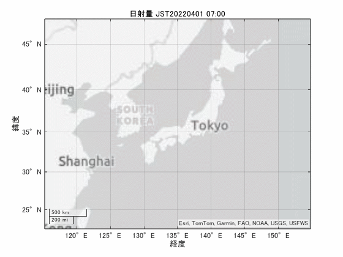

# NetCDF化した数値予報GPVデータの取得

京都大学生存圏研究所「数値予報GPV」https://database.rish.kyoto\-u. ac.jp/ におけるnetcdfデータの取得

[**https://database.rish.kyoto\-u.ac.jp/arch/jmadata/gpv\-netcdf.html**](https://database.rish.kyoto-u.ac.jp/arch/jmadata/gpv-netcdf.html)

詳細は上記サイト参照
取得するデータ:降水量，日射量

[**https://database.rish.kyoto\-u.ac.jp/arch/jmadata/data/gpv/netcdf/MSM\-S/r1h/**](https://database.rish.kyoto-u.ac.jp/arch/jmadata/data/gpv/netcdf/MSM-S/r1h/)

**パラメータ等は下記参照**

[https://www.jmbsc.or.jp/jp/online/file/f\-online10200.html](https://www.jmbsc.or.jp/jp/online/file/f-online10200.html)

ncdisp関数でも見れるよう

# ファイルダウンロード
## 初期設定と取得する日付設定
```matlab
clear;
```
### 取得日付（sDay~eDay）

期間が長くなりすぎると時間とファイルが膨大となるため注意。


なお、時差を考慮し、1日前から取得している。

```matlab
year=2022;
sDay=datetime(year,4,1);%datetime(year,1,1);
eDay=datetime(year,6,1);%min(datetime(year+1,1,1),datetime("today")); % 今年を入れた場合に前日になるように変更

tr=timerange(sDay,eDay,"openright");

UTC2JSTtimedif=duration(9,0,0);

dswrfTbl=timetable();
```

```matlab
for iDay=(sDay-duration(24,0,0)):days(1):(eDay)
  
    filename=string(iDay,"MMdd")+".nc";    
     
    [y,m,d]=ymd(iDay);
    if d==1
        iDay
    end

    folderpath=fullfile("MSM-S","r1h",num2str(y));
    if exist(folderpath,"dir")==0
        mkdir(folderpath);
    end
    filepath=fullfile(pwd,folderpath,filename);

    url="https://database.rish.kyoto-u.ac.jp/arch/jmadata/data/gpv/netcdf/MSM-S/r1h/"+num2str(y,"%4d")+"/"+filename;

    ncfilename = websave(filepath,url,weboptions("ContentType","text"));
    %
    
    %同一データは初回のみ読み込み
    if isempty(dswrfTbl)==1
        lon=ncread(ncfilename,'lon');  %経度
        lat=ncread(ncfilename,'lat');  %緯度
        time=ncread(ncfilename,'time');%時間
    end

    dswrf=ncread(ncfilename,'dswrf');  %各データ読み込み
    celldswrf=cell(24,1);
    for iHour=1:24
        numdata=double(dswrf(:,:,iHour));
        if max(numdata,[],"all")>0.1
            celldswrf{iHour}=dswrf(:,:,iHour);
        else
            celldswrf{iHour}=[];%sparse(length(lon),length(lat));
        end
    end   

    tbl=timetable(iDay+duration(double(time),0,0)+UTC2JSTtimedif,celldswrf);

    dswrfTbl=[dswrfTbl;tbl];    
    %}
end

dswrfTbl=dswrfTbl(tr,:);
info=ncinfo(ncfilename);

dswrfTbl.Properties.VariableNames(1)={'dswrf'};
dswrfTbl.Properties.Description =info.Variables(5).Attributes(3).Value; %dswrfの説明(日射量)
dswrfTbl.Properties.Description =info.Variables(5).Attributes(4).Value; %dswrfの単位

filename="nc_"+string(dswrfTbl.Time(1),'yyyyMMdd')+"-"+string(dswrfTbl.Time(end),'yyyyMMdd')+".mat";
save(filename,'dswrfTbl','lon','lat','-v7.3');

```
# 可視化サンプルコード

例として3日間の日射量の地図プロットしたコードを示す。



```matlab
figure;

%double型へ変換
lon=double(lon); 
lat=double(lat);

[Lat,Lon ]=meshgrid(lat,lon);
vLat=reshape(Lat,[length(lat)*length(lon),1,1]);
vLon=reshape(Lon,[length(lat)*length(lon),1,1]);

iDay=sDay;

for iH=1:24*3
    
    if isempty(dswrfTbl.dswrf{iDay+duration(iH,0,0)})==0
    % Create a scatter plot
    data=reshape(dswrfTbl.dswrf{iDay+duration(iH,0,0)},[length(lat)*length(lon),1,1]);
    
    area_data=dswrfTbl.dswrf{iDay+duration(iH,0,0)}(256:310,231:272);

    idx=1:1:length(data);
    g=geoscatter(vLat(idx), vLon(idx), 5, [ones(length(data(idx)),1),(1-(data(idx)/1000)).*ones(length(data(idx)),2)],'filled');%scatterm ones(length(data(idx)),2)-data(idx)/max(data)
    g.MarkerEdgeColor="none";
    %g.MarkerEdgeAlpha=0.9;
    %g.MarkerFaceColor="auto";
    g.MarkerFaceAlpha=0.01;
    
    geolimits manual
    geolimits([min(lat),max(lat)],[min(lon),max(lon)]);

    title(strcat('日射量 JST',string(dswrfTbl.Time(iDay+duration(iH,0,0)),"yyyyMMdd HH:mm")));
    
    pause(0.1); % Pause for a short duration to create animation effect
    end
end

```
